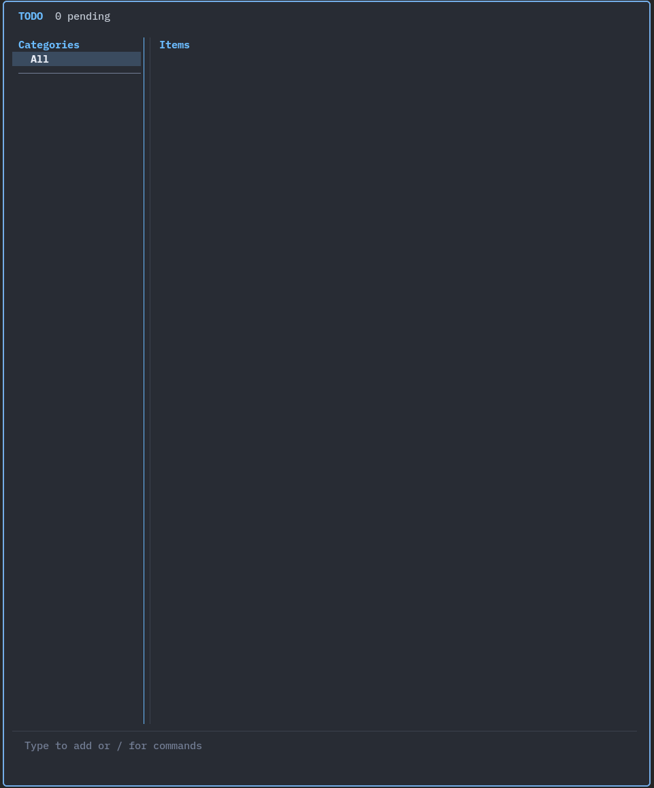

# todo-tui

A keyboard-driven terminal todo app built with Ratatui and crossterm.



## Install With Nix / NixOS

### As a flake input in your NixOS or home-manager config (recommended)

Add to your `flake.nix` inputs:

```nix
inputs = {
  # ... your other inputs
  todo-tui = {
    url = "github:giorgoskouroupis/my-todo-tui/v0.8.2";
    inputs.nixpkgs.follows = "nixpkgs";
  };
};
```

Reference the package in your home-manager (or system) config:

```nix
home.packages = [
  inputs.todo-tui.packages.${pkgs.stdenv.hostPlatform.system}.default
];
```

Then `sudo nixos-rebuild switch --flake .` (or `home-manager switch --flake .`). `todo-tui` will be on your `PATH`.

### One-shot / quick try

```sh
nix run github:giorgoskouroupis/my-todo-tui                # try it without installing
nix profile install github:giorgoskouroupis/my-todo-tui    # install to user profile
```

### From a local clone (for hacking on the code)

```sh
git clone https://github.com/giorgoskouroupis/my-todo-tui
cd my-todo-tui
nix develop --command cargo build --release
./target/release/todo-tui
```

## Install On Debian/Ubuntu

Make sure Rust is installed. On Debian 13+ / Ubuntu 24.04+ you can install `rustup` straight from apt (recommended, keeps you on a current toolchain):

```sh
sudo apt install -y rustup git
rustup default stable
```

On older releases either grab `rustup` from [rustup.rs](https://rustup.rs), or use the apt-provided compiler:

```sh
sudo apt install -y cargo rustc git
```

Then clone and build:

```sh
git clone https://github.com/giorgoskouroupis/my-todo-tui
cd my-todo-tui
cargo build --release
```

Copy the binary somewhere on your `PATH`:

```sh
mkdir -p ~/.local/bin
cp target/release/todo-tui ~/.local/bin/
```

If `~/.local/bin` isn't on your `PATH`, add this line to your `~/.bashrc` (or `~/.zshrc`) and reopen your terminal:

```sh
export PATH="$HOME/.local/bin:$PATH"
```

Now run `todo-tui`.

To update later:

```sh
cd my-todo-tui
git pull
cargo build --release
cp target/release/todo-tui ~/.local/bin/
```

### Build a `.deb` (optional)

```sh
sudo apt install -y dpkg-dev
cargo install cargo-deb
cargo deb
# sudo apt install ./target/debian/todo-tui_*.deb
```

## Core Controls

| Key | Action |
|---|---|
| `Up`/`Down` | Navigate |
| `Enter` | Toggle done |
| `Space` | Toggle doing |
| `Ctrl+E` | Edit selected item, or create one if the list is empty |
| `Delete` | Confirm-delete selected item |
| `Ctrl+P` / `Ctrl+Shift+P` | Cycle priority forward/backward |
| `Ctrl+Up` / `Ctrl+Down` | Reorder item |
| `*` / `Ctrl+*` | Toggle pin |
| `Left` / `Right` / `Tab` | Switch between items and category sidebar |
| `PageUp` / `PageDown` | Switch category filter |
| `Ctrl+O` | Assign category to selected item |
| `Ctrl+D` | Open due-date calendar |
| `Ctrl+B` | Resize sidebar (`←/→` ±1, `Shift+←/→` ±5, `r` reset, `Enter` save, `Esc` cancel) |
| `/` | Command mode |
| `Ctrl+Z` | Undo last delete or archive (up to 20 levels) |
| `Ctrl+K` | Show keybindings |
| `Ctrl+H` | Show help |
| `Ctrl+C` | Quit |

Any other printable character in the items pane starts a new todo prefilled with that character. In the sidebar it starts a new category.

Command mode supports `/search`, `/delete`, `/done`, `/select`, `/clear`, `/reset`, `/themes`, `/sort`, `/sidebar`, `/help`, and `/keybindings`, plus unified `/filter` subcommands, `/archive` subcommands, `/rename`, and `/move` to open the category picker. `/select` toggles into a generic bulk-select mode: `Space` toggles items/categories, `Ctrl+A` selects all, and `Enter` opens an action popup (`Delete`, `Archive`, `Toggle done`, `Assign category`, plus `Edit` when the selection is a single item) applied to the whole selection.

`/search` types-to-filter live. `↑`/`↓` navigate the filtered list. Item shortcuts work on the highlighted result while typing: `Ctrl+P` / `Ctrl+Shift+P` cycle priority, `Ctrl+↑/↓` reorder, `Ctrl+*` toggle pin, `Ctrl+D` opens the due-date calendar, `Ctrl+E` edits the item, `Ctrl+O` assigns a category. `Enter` opens the same action popup as `/select` but on the single highlighted item (or press `Tab` first to promote into bulk-select mode on the currently filtered list, where `Space` toggles multiple items). All these round-trip back to the search prompt when the target flow finishes, so the query you were building is never lost. `Esc` clears the filter.

`/themes` shows themes grouped by `Light` and `Dark`. Light: `catppuccin-latte`, `gruvbox-light`, `one-light`, `solarized-light`. Dark: `catppuccin-mocha`, `dracula`, `gruvbox`, `nord`, `one-dark`. Type a command prefix to filter the popup, press `Tab` to autocomplete the highlighted command or subcommand, and press `Enter` to execute it. `/filter category` filters the visible list; `/filter clear` and `/reset` clear filters and restore the default view. `Ctrl+O` assigns/moves the selected item. `/move` assigns the selected item in the items pane, or moves the highlighted category branch in the sidebar. `/archive one` archives the current item in the items pane or the highlighted category branch in the sidebar; from `All`, `/archive one` archives all visible items and categories. `/archive bulk` bulk-selects items or categories based on the active pane, `/archive restore bulk` restores archived items or categories, and `/archive archived` toggles archived view. `/archived` and `/unarchive` remain hidden aliases. `/rename` edits the selected item in the items pane or the highlighted category in the sidebar; `/rename old new` remains available for direct category-path renames. In `/delete`, `Ctrl+A` opens a confirmation popup for all current delete targets. In the items pane it deletes visible items only and keeps category names; in the category pane it deletes all items and all category names.

Categories can be flat (`Dog`) or nested with `/` (`Work/work2`). The sidebar groups nested categories under their parent; selecting the parent includes both direct parent items and nested subcategories. In the sidebar, type a category name directly and press `Enter`; if categories already exist, the placement popup asks whether to attach under the highlighted category or create at root. From `All`, attach opens a parent picker. Manual `Parent/child` entry still works as a shortcut. Global `All` shows full badges like `[Work|work2]`; a parent filter like `Work` shows shorter child badges like `[work2]`.

Due-date calendar keys: `Tab` switches focus between the calendar and the bottom date prompt. The popup opens near the selected item from Normal mode and near the input bar from editing/new-item flows; the rest of the UI is muted while the active calendar or prompt stays highlighted. In calendar focus, arrows move by day/week, `PageUp`/`PageDown` change month, `Ctrl+T` jumps to today, and `Delete` clears. In prompt focus, type digits or `-` to edit `YYYY-MM-DD`, and arrows move the cursor. `Enter` saves a valid date and `Esc` cancels. Due dates render muted by default, yellow within 10 days, and red within 3 days or overdue.

## Storage

Todos are stored as JSON at:

```text
$XDG_STATE_HOME/todo-tui/todos.json
```

If `XDG_STATE_HOME` is unset, the app uses:

```text
$HOME/.local/state/todo-tui/todos.json
```

Theme configuration is stored at:

```text
$XDG_CONFIG_HOME/todo-tui/config.json
```

## Dependencies

The runtime dependency set is intentionally small:

- `ratatui` for TUI layout/rendering
- `crossterm` for terminal control and input events
- `serde` and `serde_json` for local JSON storage/config
- `arboard` with default features disabled for text-only system clipboard support
